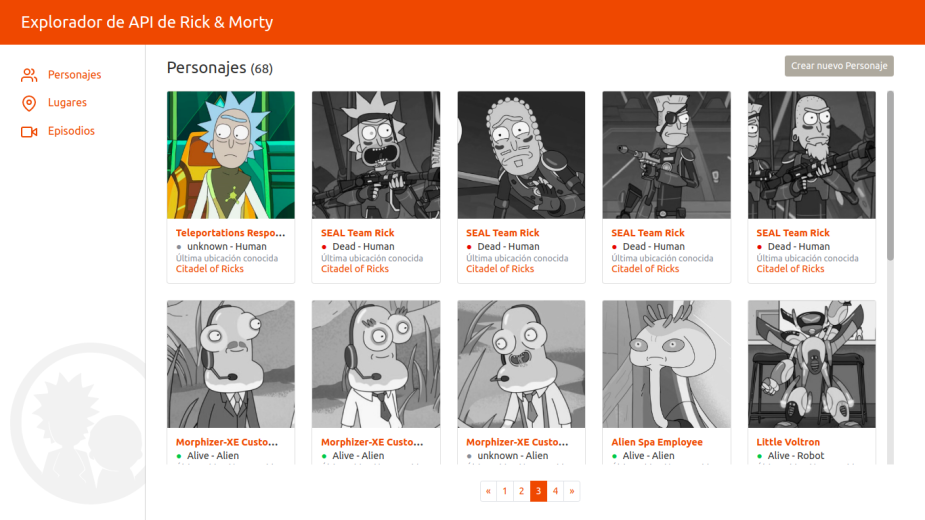
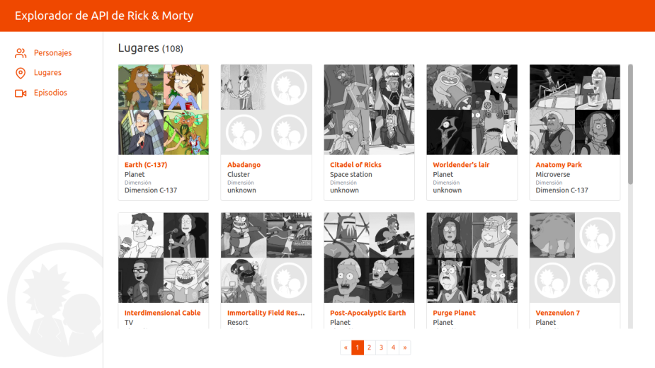
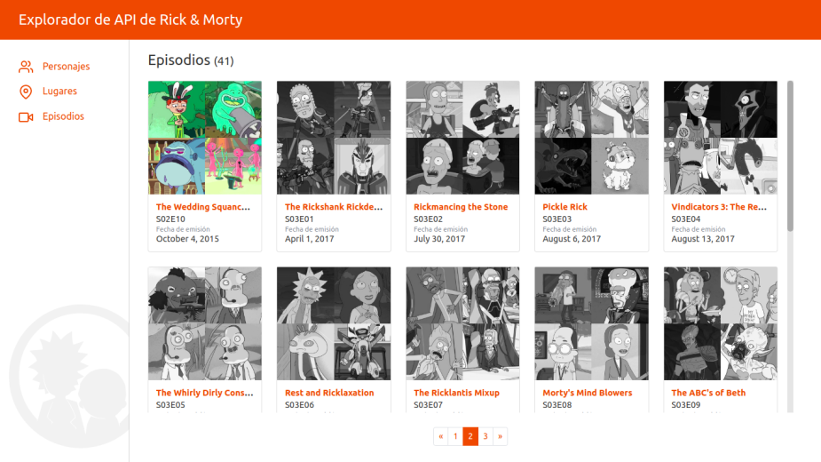
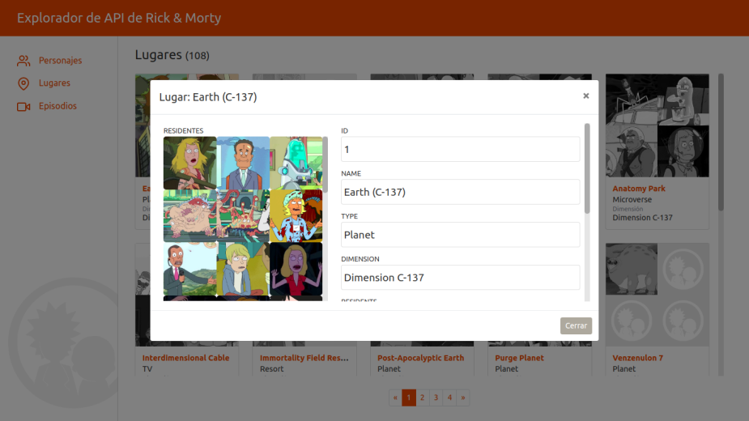
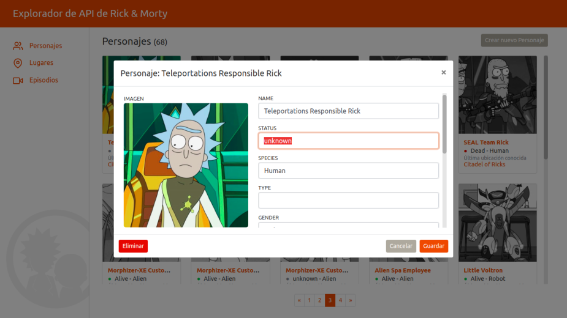
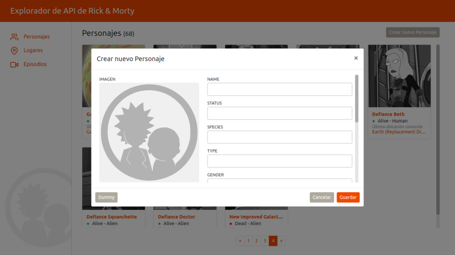
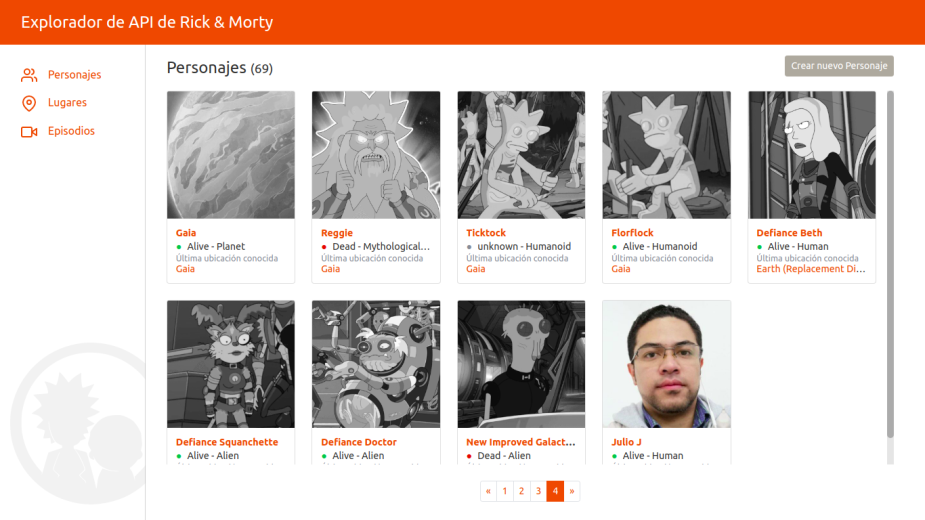
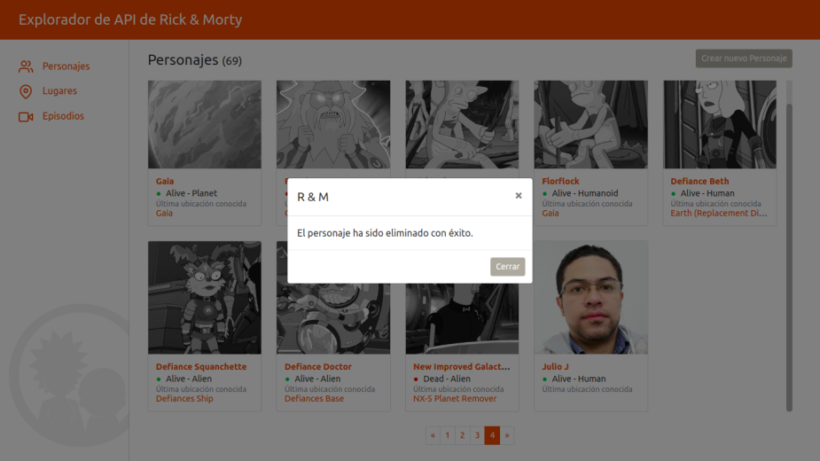

# Explorador de API de Rick & Morty
Versión alfa 1

El explorador de API de Rick y Morty es una aplicación web desarrollada fullstack en Javascript (Node.JS y React) que implementa la API pública de Rick y Morty y agrega ejemplos de usabilidad, navegación, consulta y gestión CRUD.

Esta aplicación se desarrolla con el objeto de dar solución a la evaluación técnica para la búsqueda de desarrolladores senior fullstack en Datatraffic.

Se utilizó una arquitecura Cliente / Servidor básica con un desarrollo basado en componentes CDD.

## INSTALACION
- git clone rym_app
- cd rym_app

- ### FRONTEND
    - cd ./client
    - npm install

- ### BACKEND
    - cd ./server
    - npm install

## COMPILACIÓN FRONTEND
- Para compilar React (cuando haya sido modificado) se debe ejecutar npm run build en ./client

## EJECUCION
- ### FRONTEND
    - cd ./client
    - npm run start:dev

- ### BACKEND
    - cd ./server
    - npm run start:dev

## CAPTURAS

## FEATURES
- Consume la API de RyM online a través del backend propio
- El backend expone API para manejo de CRUD de personajes
- La entidad personajes existe localmente en una base de datos SQLite
- Se incluyó TOKEN para consumo de API
- Se incluyó CRUD en frontend para personajes
- Se agregó personalización por tema Bootswatch intercambiable en index.html

## KNOWN ISSUES
- Persiste el estado de los datos en el Modal de lectura individual
- Al Abrir por primera vez el detalle de una entidad sus datos persisten en las subsiguientes, al hacer F5 y consultar otra entidad por primera vez, son estos nuevos datos los que persisten
- Al seleccionar una imagen en crear nuevo personaje, se borran los datos creados con Dummy 
- Al crear un nuevo personaje y cerrar el diálogo modal, y volver para crear uno nuevo, los datos anteriores persisten
- Al crear, modificar o eliminar un personaje, y cerrar el diálogo modal, no se está refrescando la vista del listado general, por lo que hay que cambiar de página y volver, o simplemente hacer click en la paginación de la misma página
- Al navegar entre páginas o secciones, persiste la posición del scroll de contenido

## STACK UTILIZADO
- Node JS
- Webpack
- React JS
- React Router
- Bootstrap
- Bootswatch
- SQLite
- Git y npm

## AUTOR
- Julio J. Yépez (@jjyepez)

## CONCLUSIONES
Habiendo diseñado la evaluación técnica para ser desarrollada y entregada en un plazo ideal de 48 horas (dos días), y luego de haber dedicado el tiempo necesario para desarrollar todas las funcionalidades requeridas con una calidad profesional técnica final, estabilidad, consistenca y usabilidad que estimo entre un ~85% y ~90%.

CONSIDERO que el tiempo estimado inicialmente pudiera ser insuficiente para la mayoría de los candidatos aspirantes al rol de desarrollador fullstack senior, mucho más para los candidatos a desarrollador junior, por lo que se recomienda la reconsideración de tiempos estimados y dificultad de la evaluación.

Sin embargo, en atención a las sugerencias de Juan Pablo, se pudiera utilizar el presente repositorio (corregido y completado) como base para rediseñar la estrategia de evaluación. Se debe conversar.

## FECHA DE ÚLTIMA ACTUALIZACIÓN
03/03/2021

por @jjyepez